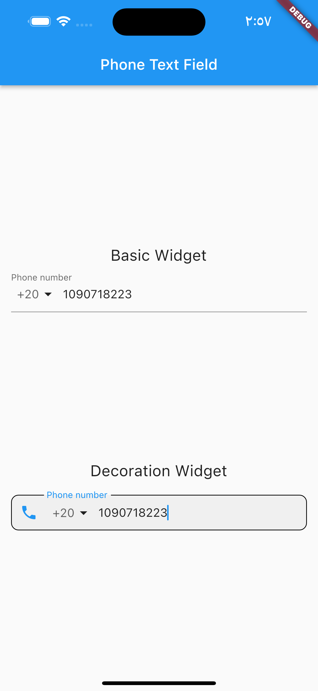
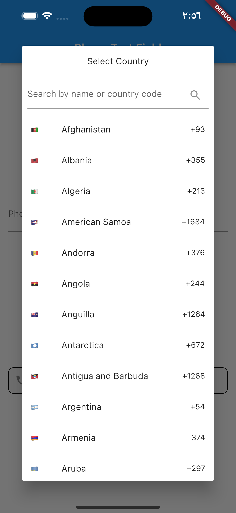
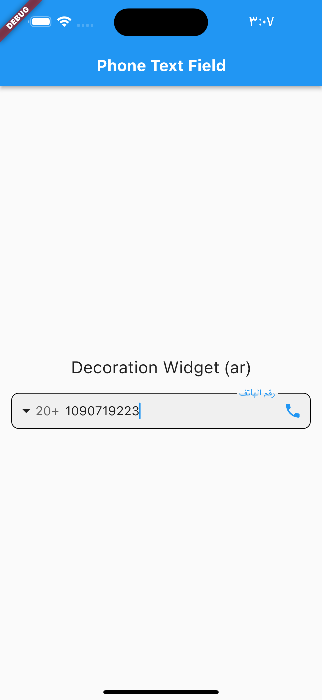
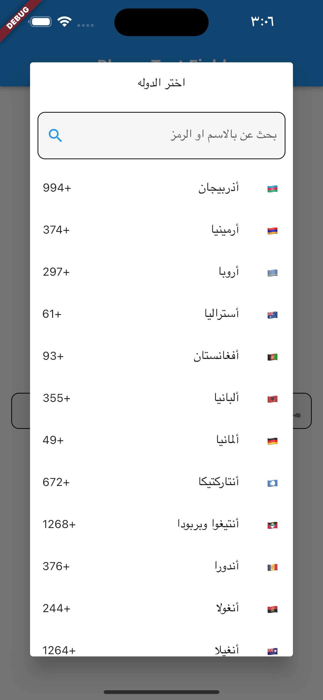

# phone_text_field

Phone Number TextFiled is a Flutter plugin that allows you to parse, validate, format and other utilities for to international phone numbers and allow localization.

[](https://pub.dev/packages/phone_text_field)


Demo gif
-----


[link](https://github.com/MohamedAbd0/phone_text_field/blob/master/screenshots/demo.gif)


Installation
-----
1. Add this to your package's `pubspec.yaml` file:

```yaml
dependencies:
  phone_text_field: any
```

1. Get the package using your IDE's GUI or via command line with

```bash
$ pub get
```

1. Import the `phone_text_field.dart` file in your app

```dart
import 'package:phone_text_field/phone_text_field.dart';
```

Features
----
- Validate phone number
- Select country code
- Allow arabic names

Usage
-----
default widget
```dart
PhoneTextField(
    onChanged: (value) {},
),
```
custom text style
```dart
                PhoneTextField(
                  locale: const Locale('en'),
                  decoration: const InputDecoration(
                    filled: true,
                    contentPadding: EdgeInsets.zero,
                    enabledBorder: OutlineInputBorder(
                      borderRadius: BorderRadius.all(Radius.circular(10.0)),
                      borderSide: BorderSide(),
                    ),
                    focusedBorder: OutlineInputBorder(
                      borderRadius: BorderRadius.all(Radius.circular(10.0)),
                      borderSide: BorderSide(),
                    ),
                    prefixIcon: Icon(Icons.phone),
                    labelText: "Phone number",
                  ),
                  searchFieldInputDecoration: const InputDecoration(
                    filled: true,
                    enabledBorder: OutlineInputBorder(
                      borderRadius: BorderRadius.all(Radius.circular(10.0)),
                      borderSide: BorderSide(),
                    ),
                    focusedBorder: OutlineInputBorder(
                      borderRadius: BorderRadius.all(Radius.circular(10.0)),
                      borderSide: BorderSide(),
                    ),
                    suffixIcon: Icon(Icons.search),
                    hintText: "Search country",
                  ),
                  initialCountryCode: "AE",
                  onChanged: (phone) {
                    debugPrint(phone.completeNumber);
                  },
                ),
```

arabic style
```dart
                PhoneTextField(
                  locale: const Locale('ar'),
                  decoration: const InputDecoration(
                    filled: true,
                    contentPadding: EdgeInsets.zero,
                    enabledBorder: OutlineInputBorder(
                      borderRadius: BorderRadius.all(Radius.circular(10.0)),
                      borderSide: BorderSide(),
                    ),
                    focusedBorder: OutlineInputBorder(
                      borderRadius: BorderRadius.all(Radius.circular(10.0)),
                      borderSide: BorderSide(),
                    ),
                    prefixIcon: Icon(Icons.phone),
                    labelText: "رقم الهاتف",
                  ),
                  searchFieldInputDecoration: const InputDecoration(
                    filled: true,
                    enabledBorder: OutlineInputBorder(
                      borderRadius: BorderRadius.all(Radius.circular(10.0)),
                      borderSide: BorderSide(),
                    ),
                    focusedBorder: OutlineInputBorder(
                      borderRadius: BorderRadius.all(Radius.circular(10.0)),
                      borderSide: BorderSide(),
                    ),
                    suffixIcon: Icon(Icons.search),
                    hintText: "بحث عن بالاسم او الرمز",
                  ),
                  dialogTitle: "اختر الدوله",
                  initialCountryCode: "AE",
                  onChanged: (phone) {
                    debugPrint(phone.completeNumber);
                  },
                ),
```

## Screenshots


local(en)



local(ar)


## Contributions

Contributions of any kind are more than welcome! Feel free to fork and improve international_phone_input in any way you want, make a pull request, or open an issue.