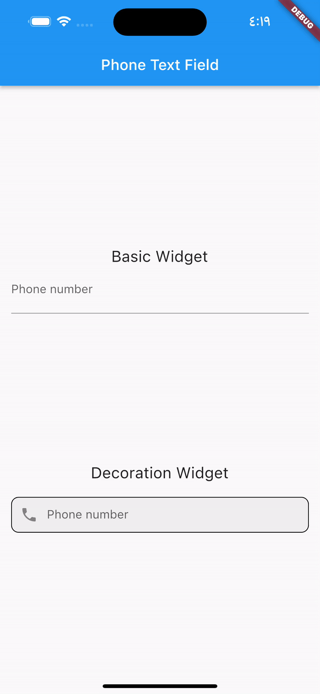

# 📱 Phone Text Field

[](https://pub.dev/packages/phone_text_field)
[](https://flutter.dev)
[](LICENSE)
[](https://github.com/MohamedAbd0/phone_text_field)

A comprehensive **Flutter package** for international phone number input with **validation**, **formatting**, and **country selection**. Perfect for apps requiring phone number collection with proper validation and beautiful UI.

## 🚀 Live Demo

🌐 **[Try the Interactive Web Demo](https://mohamedabd0.github.io/phone_text_field/)** - Experience all features in your browser!

📱 **Mobile Demo**: Clone and run the example app to see it in action on mobile devices.

## ✨ Demo


## 🎯 Key Features

### 🌍 **International Support**

- **200+ countries** with proper validation rules
- **Automatic formatting** based on country standards
- **Real-time validation** with visual feedback
- **Smart country detection** from phone numbers

### 🎨 **Customizable UI**

- **Material 3 Design** support
- **Dark/Light theme** compatibility
- **Flexible styling** options
- **Custom decorations** for input fields
- **Responsive design** for web and mobile

### 🔧 **Developer-Friendly**

- **TextEditingController** support for form integration
- **Validation callbacks** with custom error messages
- **Localization support** (Arabic, English, French)
- **TypeScript-like** strongly typed API
- **Well-documented** with comprehensive examples

### 🐛 **Recent Bug Fixes (v1.0.0+)**

- ✅ **Fixed controller integration** - Proper TextEditingController support
- ✅ **Fixed +1 country codes** - US/Canada flag switching issue resolved
- ✅ **Fixed Chinese validation** - Corrected 11-digit validation for China
- ✅ **Improved performance** - Optimized country selection logic

## 📦 Installation

### 1. Add Dependency

Add this to your `pubspec.yaml`:

```yaml
dependencies:
  phone_text_field: ^1.0.0 # Use latest version
```

### 2. Install

```bash
flutter pub get
```

### 3. Import

```dart
import 'package:phone_text_field/phone_text_field.dart';
```

## 🔥 Quick Start

### Basic Usage

```dart
PhoneTextField(
  onChanged: (phoneNumber) {
    print('Complete number: ${phoneNumber.completeNumber}');
    print('Country: ${phoneNumber.countryISOCode}');
  },
)
```

### With Controller (Form Integration)

```dart
class MyForm extends StatefulWidget {
  @override
  _MyFormState createState() => _MyFormState();
}

class _MyFormState extends State<MyForm> {
  final _phoneController = TextEditingController();
  final _formKey = GlobalKey<FormState>();

  @override
  Widget build(BuildContext context) {
    return Form(
      key: _formKey,
      child: PhoneTextField(
        controller: _phoneController,
        isRequired: true,
        autovalidateMode: AutovalidateMode.onUserInteraction,
        decoration: const InputDecoration(
          labelText: 'Phone Number',
          border: OutlineInputBorder(),
        ),
        onChanged: (phoneNumber) {
          // Handle phone number changes
        },
      ),
    );
  }

  @override
  void dispose() {
    _phoneController.dispose();
    super.dispose();
  }
}
```

## 🎨 Advanced Examples

### Custom Styling with Material 3

```dart
PhoneTextField(
  initialCountryCode: 'AE',
  decoration: const InputDecoration(
    filled: true,
    labelText: 'Phone Number',
    border: OutlineInputBorder(
      borderRadius: BorderRadius.all(Radius.circular(12)),
    ),
    prefixIcon: Icon(Icons.phone),
  ),
  searchFieldInputDecoration: const InputDecoration(
    filled: true,
    border: OutlineInputBorder(
      borderRadius: BorderRadius.all(Radius.circular(12)),
    ),
    suffixIcon: Icon(Icons.search),
    hintText: 'Search country',
  ),
  countryViewOptions: CountryViewOptions.countryCodeWithFlag,
  onChanged: (phoneNumber) {
    debugPrint('Phone: ${phoneNumber.completeNumber}');
  },
)
```

### Arabic Localization

```dart
PhoneTextField(
  locale: const Locale('ar'),
  decoration: const InputDecoration(
    filled: true,
    labelText: 'رقم الهاتف',
    border: OutlineInputBorder(
      borderRadius: BorderRadius.all(Radius.circular(12)),
    ),
    prefixIcon: Icon(Icons.phone),
  ),
  searchFieldInputDecoration: const InputDecoration(
    filled: true,
    border: OutlineInputBorder(
      borderRadius: BorderRadius.all(Radius.circular(12)),
    ),
    suffixIcon: Icon(Icons.search),
    hintText: 'بحث عن بالاسم او الرمز',
  ),
  dialogTitle: 'اختر الدولة',
  initialCountryCode: 'AE',
  onChanged: (phoneNumber) {
    debugPrint('رقم الهاتف: ${phoneNumber.completeNumber}');
  },
)
```

### Validation & Error Handling

```dart
PhoneTextField(
  isRequired: true,
  invalidNumberMessage: 'Please enter a valid phone number',
  autovalidateMode: AutovalidateMode.onUserInteraction,
  decoration: const InputDecoration(
    labelText: 'Phone Number *',
    border: OutlineInputBorder(),
    helperText: 'Enter your phone number with country code',
  ),
  onChanged: (phoneNumber) {
    if (phoneNumber.isValid) {
      print('Valid number: ${phoneNumber.completeNumber}');
    }
  },
)
```

### Different Country Display Options

```dart
// Flag only
PhoneTextField(
  countryViewOptions: CountryViewOptions.countryFlagOnly,
  onChanged: (phoneNumber) {},
)

// Country name with flag
PhoneTextField(
  countryViewOptions: CountryViewOptions.countryNameWithFlag,
  onChanged: (phoneNumber) {},
)

// Country code only
PhoneTextField(
  countryViewOptions: CountryViewOptions.countryCodeOnly,
  onChanged: (phoneNumber) {},
)
```

## 📋 API Reference

### PhoneTextField Properties

| Property                     | Type                     | Default               | Description                             |
| ---------------------------- | ------------------------ | --------------------- | --------------------------------------- |
| `onChanged`                  | `Function(PhoneNumber)`  | **required**          | Callback when phone number changes      |
| `controller`                 | `TextEditingController?` | `null`                | Controller for form integration         |
| `initialCountryCode`         | `String?`                | `null`                | Initial country code (e.g., 'US', 'AE') |
| `initialValue`               | `String?`                | `null`                | Initial phone number value              |
| `decoration`                 | `InputDecoration?`       | `null`                | Input field decoration                  |
| `searchFieldInputDecoration` | `InputDecoration?`       | `null`                | Country search field decoration         |
| `locale`                     | `Locale?`                | `null`                | Localization (ar, en, fr)               |
| `isRequired`                 | `bool`                   | `false`               | Whether the field is required           |
| `invalidNumberMessage`       | `String?`                | `null`                | Custom validation error message         |
| `countryViewOptions`         | `CountryViewOptions`     | `countryCodeWithFlag` | How to display countries                |
| `dialogTitle`                | `String?`                | `null`                | Custom dialog title                     |
| `autovalidateMode`           | `AutovalidateMode?`      | `null`                | When to validate input                  |

### PhoneNumber Object

```dart
class PhoneNumber {
  String completeNumber;      // Full international number
  String countryISOCode;      // Country code (US, AE, etc.)
  String countryCode;         // Dial code (+1, +971, etc.)
  String number;              // Local number
  bool isValid;               // Validation status
}
```

### CountryViewOptions

```dart
enum CountryViewOptions {
  countryCodeOnly,           // +1
  countryNameOnly,           // United States
  countryFlagOnly,           // 🇺🇸
  countryCodeWithFlag,       // 🇺🇸 +1
  countryNameWithFlag,       // 🇺🇸 United States
}
```

## 🔧 Integration Examples

### With Form Validation

```dart
class PhoneForm extends StatefulWidget {
  @override
  _PhoneFormState createState() => _PhoneFormState();
}

class _PhoneFormState extends State<PhoneForm> {
  final _formKey = GlobalKey<FormState>();
  final _phoneController = TextEditingController();
  PhoneNumber? _phoneNumber;

  @override
  Widget build(BuildContext context) {
    return Form(
      key: _formKey,
      child: Column(
        children: [
          PhoneTextField(
            controller: _phoneController,
            isRequired: true,
            autovalidateMode: AutovalidateMode.onUserInteraction,
            decoration: const InputDecoration(
              labelText: 'Phone Number *',
              border: OutlineInputBorder(),
            ),
            onChanged: (phoneNumber) {
              setState(() {
                _phoneNumber = phoneNumber;
              });
            },
          ),
          const SizedBox(height: 20),
          ElevatedButton(
            onPressed: () {
              if (_formKey.currentState!.validate() &&
                  _phoneNumber?.isValid == true) {
                // Process valid phone number
                print('Valid phone: ${_phoneNumber!.completeNumber}');
              }
            },
            child: const Text('Submit'),
          ),
        ],
      ),
    );
  }

  @override
  void dispose() {
    _phoneController.dispose();
    super.dispose();
  }
}
```

### With Bloc/Provider State Management

```dart
// Using Provider
class PhoneProvider extends ChangeNotifier {
  PhoneNumber? _phoneNumber;

  PhoneNumber? get phoneNumber => _phoneNumber;

  void updatePhone(PhoneNumber phoneNumber) {
    _phoneNumber = phoneNumber;
    notifyListeners();
  }
}

// In your widget
Consumer<PhoneProvider>(
  builder: (context, phoneProvider, child) {
    return PhoneTextField(
      onChanged: (phoneNumber) {
        phoneProvider.updatePhone(phoneNumber);
      },
    );
  },
)
```

## 🐛 Bug Fixes & Improvements

### Version 1.0.0+ Fixes

#### ✅ Controller Integration Issue (#2)

**Problem**: Controller property was commented out, causing integration issues with forms.

```dart
// Before (broken)
// final TextEditingController? controller;

// After (fixed)
final TextEditingController? controller;
```

#### ✅ +1 Country Code Flag Switching (#3)

**Problem**: When editing US/Canada numbers, flag would incorrectly switch between countries.
**Solution**: Improved country selection logic to preserve originally selected country when multiple countries share the same dial code.

#### ✅ Chinese Phone Number Validation (#4)

**Problem**: Chinese numbers were validated as 12 digits instead of 11.

```dart
// Before
'CN': {minLength: 12, maxLength: 12}

// After
'CN': {minLength: 11, maxLength: 11}
```

### Testing the Fixes

You can test these fixes in the [example app](./example) or the [live demo](https://your-demo-url.com):

1. **Controller Test**: Use the form integration examples
2. **+1 Countries Test**: Try switching between US (+1) and Canada (+1)
3. **Chinese Numbers Test**: Enter a Chinese number like `13812345678`

## 🌍 Supported Countries

This package supports **200+ countries** with proper validation rules including:

- 🇺🇸 United States (+1)
- 🇨🇦 Canada (+1)
- 🇬🇧 United Kingdom (+44)
- 🇦🇪 United Arab Emirates (+971)
- 🇨🇳 China (+86)
- 🇮🇳 India (+91)
- 🇧🇷 Brazil (+55)
- 🇩🇪 Germany (+49)
- 🇫🇷 France (+33)
- 🇯🇵 Japan (+81)
- And many more...

## 🌐 Localization

The package supports multiple languages:

| Language | Locale | Status          |
| -------- | ------ | --------------- |
| English  | `en`   | ✅ Full Support |
| Arabic   | `ar`   | ✅ Full Support |
| French   | `fr`   | ✅ Full Support |

### Adding New Languages

Contributions for additional languages are welcome! Check our [contribution guide](#-contributing) for details.

## 📱 Platform Support

| Platform   | Status          | Notes               |
| ---------- | --------------- | ------------------- |
| 📱 iOS     | ✅ Full Support | iOS 9.0+            |
| 🤖 Android | ✅ Full Support | API 16+             |
| 🌐 Web     | ✅ Full Support | All modern browsers |
| 🖥️ macOS   | ✅ Full Support | macOS 10.11+        |
| 🖥️ Windows | ✅ Full Support | Windows 10+         |
| 🐧 Linux   | ✅ Full Support | Any distribution    |

## 🎯 Examples & Demos

### 📱 Example App

Run the comprehensive example app:

```bash
cd example
flutter run
```

### 🌐 Web Demo

Experience the full demo in your browser:

```bash
cd example
flutter run -d chrome
```

### 📋 Code Examples

- [Basic Usage](./example/lib/basic_example.dart)
- [Form Integration](./example/lib/form_example.dart)
- [Custom Styling](./example/lib/styling_example.dart)
- [Localization](./example/lib/localization_example.dart)

## 📸 Screenshots

### 📱 Feature Gallery (Grid Layout)

<table>
  <tr>
    <td align="center" width="50%">
      
      <br>
      <strong>🌍 Country Selection</strong>
      <br>
      <em>Easy country selection with search functionality</em>
    </td>
    <td align="center" width="50%">
      
      <br>
      <strong>📱 Phone Input</strong>
      <br>
      <em>Clean phone number input with validation</em>
    </td>
  </tr>
  <tr>
    <td align="center" width="50%">
      
      <br>
      <strong>🇸🇦 Arabic Localization</strong>
      <br>
      <em>Full RTL support with Arabic text</em>
    </td>
    <td align="center" width="50%">
      
      <br>
      <strong>✅ Validation & Error Handling</strong>
      <br>
      <em>Real-time validation with error messages</em>
    </td>
  </tr>
</table>

### 🎬 Live Demo

<div align="center">



_Interactive demo showing all features in action_

</div>

---

### 🎨 Key Features Grid

<div align="center">

<table>
  <tr>
    <td align="center" width="25%">
      
      <br><br>
      <strong>🌍 International</strong>
      <br>
      <small>200+ countries with proper validation rules</small>
    </td>
    <td align="center" width="25%">
      
      <br><br>
      <strong>🎨 Customizable</strong>
      <br>
      <small>Material 3 design with flexible styling</small>
    </td>
    <td align="center" width="25%">
      
      <br><br>
      <strong>🌐 Localized</strong>
      <br>
      <small>Arabic, English, French support</small>
    </td>
    <td align="center" width="25%">
      
      <br><br>
      <strong>✅ Validation</strong>
      <br>
      <small>Real-time validation with custom messages</small>
    </td>
  </tr>
</table>

</div>

### � Feature Showcase

<div align="center">

|      ✨ Feature      |             📷 Preview              | 📝 Description                              |
| :------------------: | :---------------------------------: | :------------------------------------------ |
| 🌍 **International** |  | 200+ countries with proper validation rules |
| 🎨 **Customizable**  |   | Material 3 design with flexible styling     |
|   🌐 **Localized**   |      | Arabic, English, French support             |
|  ✅ **Validation**   |   | Real-time validation with custom messages   |

</div>

## 🤝 Contributing

We welcome contributions! Here's how you can help:

### 🐛 Report Bugs

- Use the [issue tracker](https://github.com/MohamedAbd0/phone_text_field/issues)
- Include reproduction steps and Flutter/Dart versions
- Check existing issues first

### ✨ Request Features

- Open a [feature request](https://github.com/MohamedAbd0/phone_text_field/issues/new)
- Describe the use case and expected behavior
- Consider contributing the implementation

### 🔧 Submit Pull Requests

1. Fork the repository
2. Create a feature branch: `git checkout -b feature/amazing-feature`
3. Make your changes and add tests
4. Ensure all tests pass: `flutter test`
5. Commit with conventional commits: `git commit -m "feat: add amazing feature"`
6. Push to your fork: `git push origin feature/amazing-feature`
7. Open a Pull Request

### 📝 Development Setup

```bash
# Clone the repository
git clone https://github.com/MohamedAbd0/phone_text_field.git
cd phone_text_field

# Install dependencies
flutter pub get

# Run tests
flutter test

# Run example app
cd example
flutter run
```

## 📄 License

This project is licensed under the MIT License - see the [LICENSE](LICENSE) file for details.

## 👨‍💻 Author

**Mohamed Abdo**

- 🐙 GitHub: [@MohamedAbd0](https://github.com/MohamedAbd0)
- 📧 Email: [your-email@example.com](mailto:your-email@example.com)
- 🐦 Twitter: [@YourTwitter](https://twitter.com/YourTwitter)

## ⭐ Show Your Support

If this package helped you, please:

- ⭐ **Star the repository** on GitHub
- 👍 **Like the package** on [pub.dev](https://pub.dev/packages/phone_text_field)
- 🐦 **Share it** on social media
- 💝 **Consider sponsoring** the project

## 📊 Stats


---

<div align="center">

**Made with ❤️ by [Mohamed Abdo](https://github.com/MohamedAbd0)**

[⬆ Back to Top](#-phone-text-field)

</div>
